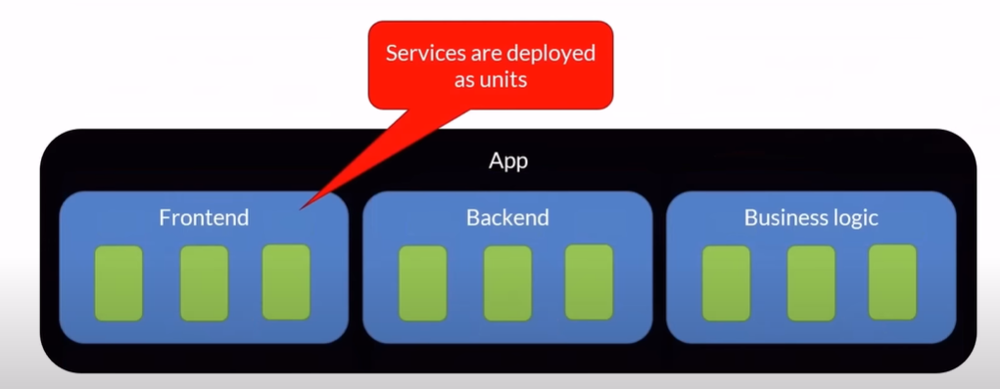
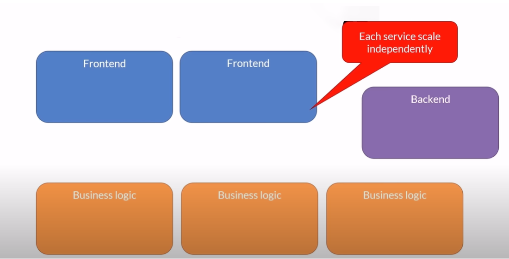

# Introduction to Microservies

### General

- A variant of the service-oriented architecture (SOA) structural style arranges an application as a collection of loosely coupled services.
  In a microservices architecture, services are fine-grained and the
  protocols are lightweight.

### Review

- Segregates functionality into smaller separate services each with a single responsibility
- Scales out by deploying each service independently
- Loosely coupled
- Enable autonomous development by different teams, languages and platforms
- Can be written by smaller teams
- Each microservice can own it’s own data/database

### Unit of deployment - Microservice

### Unit of scaling - Microservice

### **Microservices**Anti **Patterns**
